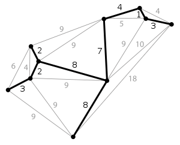

# Graph Algorithms Introduction
Graph problems are used in cases that we can represent as connections between objects.

* Shortest fly path between 2 cities in a mesh of cities.
* Create a schedule for students for all the courses that they follow
* Calculating the shortest time needed to

## Minimal Spanning Tree
### General
A spanning tree T of an undirected graph G is subgraph that includes all of the vertices of G that is a tree.

Depth-first and breadth-first searching generate spanning trees. A graph can of course have multiple spanning trees. 

If we have a directed graph then we use the value (weight) of the spanning tree as the sum of the weights of it's branches. A minimal spanning tree (MST) has the minimal weight of these kind of trees. These MST's are however not always unique. The uniqueness of a Minimum spanning tree is decided by the uniqueness of the edge weights. If these are not unique, then only the set of weights is unique.

