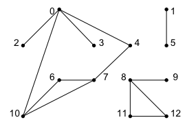
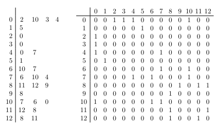
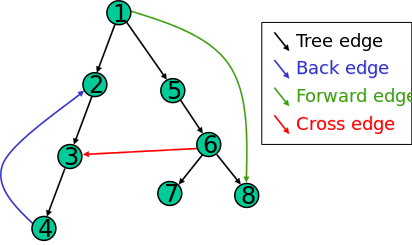
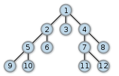

# 2.8 Graphs
* Abstract model
* Exists of n nodes or vertices
* Has a collection of m edges
* The nodes represent objects with connections
* Can have a direction.
* The grade of a node is the amount of neighbors of that node.
* For a graph with a direction, we have an ingrade, this is the amount of incoming neighbors. The same goes for the outgrade which is the amount of outgoing neighbours.
* 2 Basic representations of graphs:
    * Neighbor matrix: takes a connection (i,j) and represents it on a square neighbormatrix. This value can be logical or can be the weight. The problem is that matrices take a lot of memory en the initialization takes $$\Theta(n^2)$$ operations.
    * Neighbor lists: Mostly used when we do not have a lot of connections (m << $$n^2$$). In reality most graphs are like this. The neighbors of every node are saved in a neighbor list and the graph is represented by a table of n neighbor-lists.

These pictures show a normal graph, it's neighbor list and the neighbor matrix



Looping through a graph is different then looping through a tree, this because a graph has multiple pathways and we have to find a way to only go through each path once.

For this looping we have several methods:
## 2.8.1. Depth-first searching (DFS)
This is analog to recursive searching in a tree. We start at any node and we continue forward. It also keeps a log of the already visited nodes so we do not visit them twice. On the end we discover the remaining nodes.

DFS is used to solve problems that have one solution, such as finding the way out of a maze.

```c++
void check_node(int i) {
    discovered[i] = true;
    
    for (every neighbor j of node i) {
        if (!discovered[j]) {
            check_node(j);
        }
    }
}

void depth_first_search() {
    // No nodes discovered
    for (int i = 0; i < n; i++) {
        discovered[i] = false;
    }
    
    // Go through each node
    for (int i = 0; i < n; i++) {
        if (!discovered[i]) {
            check_node(i); // start a new tree
        }
    }
}
```

The output of DFS can be expressed as a spanning tree. Based on this we can divide the original graph into several classes:



* **Forward Edges**: Point from node to a descendant.
* **Back Edges**: Points from node to an ascendant.
* **Cross Edges**: Points to neither.
* **Tree Edges**: Appears sometimes, belongs to the spanning tree and are classified separately from forward edges.

### Performance:
The performance is determined by how the graph is represented:
* Θ(n) operations on initialisation
* We start searching from where we stopped, so Θ(n) for the second for.
* We discover every node once, Θ(n)

We get Θ(n + m) for neighbor and Θ(n + m<sup>2</sup>) = Θ(n<sup>2</sup>) for the neighbor matrix.

## 2.8.2. Breadth-first search (BFS)
### General
Start by exploring the nodes at a given depth before proceeding to the next level. This means that we will explore the children of nodes before we proceed to the children of the children. 

This is useful when we want to find the minimal path length solution, if one exists. The disadvantage is that we need to traverse the complete tree which results in a lot of nodes.

### Algorithm
BFS Uses a queue structure to hold all unexplored nodes. The order in which nodes are placed on the queue determine the type or search.

1. Place root node s on the queue
2. If queue is empty. return false and stop
3. If first element on the queue is a goal node g. Return success and stop otherwise.
4. Remove and expand the first element from the queue and place all the children at the end of the queue in any order.
5. Return to step 2



### PseudoCode

**Input:** Graph G, Vertice of G called v.

**Output:** All vertices reachable from v labeled as discovered.

    procedure BFS(G,v) is
          let Q be a queue
          Q.enqueue(v)
          label v as discovered
          while Q is not empty
             v ← Q.dequeue()
             for all edges from v to w in G.adjacentEdges(v) do
                 if w is not labeled as discovered
                     Q.enqueue(w)
                     label w as discovered
                     
### Implementation
```c++
void Graph::BFS(int s, int numberOfVertices) {
    // Mark all vertices as not explored
    bool *explored = new bool[numberOfVertices];

    for (int = 0; i <= numberOfVertices; i++)
        explored[i] = false;
        
    // Create the queue for BFS
    list<int> queue;
    
    // Push root vertex to the queue
    Q.enqueue(s);
    explored[s] = true; // Of course we have explored this one already
    
    // So as long as the queue is not empty
    while (!Q.isEmpty()) {
        // Remove vertex from the queue
        int v = Q.dequeue();
        
        // Display explored vertice
        std::cout << v << " ";
        
        // From the explored vertice, try to explore all the connected vertices
        for (int j = 1; j <= n; j++) {
        }
    }
```
                     
### Classes
We can divide the connections into classes as we did with DFS:

* TreeNode: Connection with undiscovered node
* BackEdge: Connection with ascendant.
* CrossEdge: Connection with no ascendants and descendants.

> We can not have forward edges, this because we start from a root node and go downwards.

### Applications
BFS has many applications, some of them are:

* Testing a graph for it's bipartiteness.
* Finding loops in undirected graphs.
* Finding the shortest path between 2 nodes u and v.

### Performance

* Initialisation: $$\Theta(n)$$
* We put elements on queue and dequeue them, these operations are O(1), so we get $$\Theta(n)$$
* We go through each neighbor, this is $$\Theta(n)$$ for the neighbor lists and $$\Theta(n^2)$$ for the neighbor matrix.

So depending on the way we represent the graph we get $$\Theta(n + m)$$ for the list and $$\Theta(n^2)$$ for the matrix.